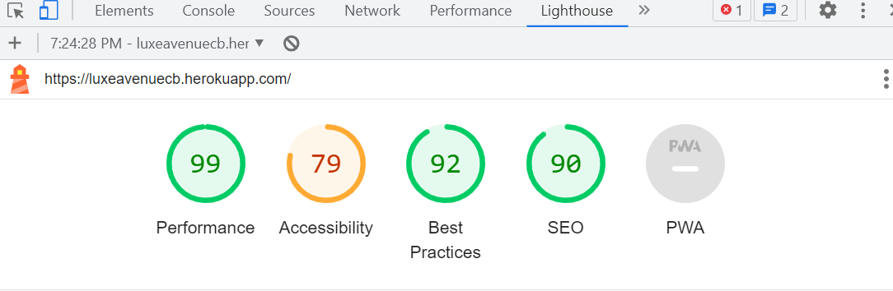

# <div align="center">**Luxe Avenue**</div>

[View the live site here](https://luxeavenuecb.herokuapp.com) 

## **Project Overview**

Luxe Avenue is a fictitious multi-brand full stack ecommerce store built using Django, Python, Javascript, HTML, CSS and Bootstrap 4. This web application is a full business to consumer (B2C) online retailer selling luxury goods. The website is deployed to Heroku, uses Amazon S3 for cloud storage and Stripe for payments.  No real orders can be processed for delivery as this project is for educational purposes only.

The site provides users with different functionalities that ease the process of purchasing a product. Users of the site can browse all products, filter products with a variety of categories and also search for specific products by keyword search. From the list of products, users can select them to display each product in detail, giving them the option to add the product to their shopping bag or return to the product list page to browse other products. Authenticated users can also checkout securely inputting their personal and payment details to purchase a product and also store these details on their profile for easier future purchases. On the other hand, the site provides the store owner with functionalities such as product management (add, edit & delete products) without accessing the admin interface.

This website application includes CRUD functionality, user authentication (using Django's allauth library), email validation and database interaction.

------

 # **Table of Contents**

[UX](#ux)

   1. [Strategy](#strategy)
   * [Project Goals](#project-goals)
   * [User Stories](#user-stories)
   2. [Scope](#scope)
   * [Features](#features)
   * [Future Features](#future-features)
   3. [Structure](#structure)
   * [Code Structure](#code-structure)
   * [Database Models](#database-models)
   4. [Skeleton](#skeleton)
   * [Wireframes](#wireframes)
   * [Home Page(Desktop)](https://github.com/)
   5. [Surface](#surface)
   * [Colour Scheme](#colour-scheme)
   * [Typography](#typography)
   * [Media](#media)

   [Search Engine Optimisation](#search-engine-optimisation)

   [Web Marketing](#web-marketing)

   [Technologies Used](#technologies-used)

   * [Languages](#languages)
   * [Hosting](#hosting)
   * [Frameworks, Libraries and Tools](#frameworks-libraries-and-tools)

   [Testing](#testing)

   * [Browser Compatibility](#browser-compatibility)
   * [User Stories Testing](#user-stories-testing)
   * [Validator Testing](#validator-testing)
   * [Manual Testing](#manual-testing)
   * [Lighthouse](#lighthouse)

   [Deployment](#deployment)

   * [Django](#django)
   * [Heroku](#heroku)
   * [AWS](#aws)
   * [Connecting AWS to Django](#connecting-aws-to-django)
   * [Stripe](#stripe)

   [Credits](#credits)

   ------

## **UX**

## 1. Strategy

### **Project Goals**

- To provide a B2C ecommerce site selling luxury goods to customers.
- To provide users with different functionalities such as user authentication, product purchase, profile, sign-up for newsletter, store locator.
- To provide the store owner the ability to manage the site to update products and information.<br><br>

### **User Stories**

***Epic 1: Basic Setup of Shop and Products***

| ID | User Story                                                                                          |
|----|-----------------------------------------------------------------------------------------------------|
| 1  | As a **developer** I can set up the project so that it is ready for implementing core features      |
| 2  | As a **developer** I can create a base HTML template page so that all pages can use the same format |
| 3  | As a **developer** I can setup the project basic apps so that the products can be displayed         |

***Epic 2: Admin/Shop Owner***
| ID  | User                                                                                                      Story                                                                                                      | 
|-----|----------------------------------------------------------------------------------------------------|
| 4   | As a **shop owner** I can log in so that I have full access to the store administration page                                                                              |   |
| 5   | As a **shop owner** I can add products to the shop so that there is a good variety of products available                                                                  |   |
| 6   | As a **shop owner** I can edit/delete a category so that the website is up to date at all times                                                                           |   |
| 7   | As a **shop owner** I can edit/update product information so that the product description and price is up to date                                                         |   |
| 8   | As a **shop owner** I can delete products so that I can remove products that are no longer available                                                                      |   |
| 9   | As a **shop owner** I can add a new category to the shop so that there is a better selection of products available                                                        |   |
| 10  | As a **shop owner** I can send a newsletter to registered shoppers via email so that they are kept up to date about promotions, special offers and new products available |   |
| 11  | As a **shop owner** I can add a store finder so that customers can see a list of the shops branches and locate one nearest to them                                        |   |
| 12  | As a **shop owner** I can display the privacy policy and terms & conditions pages on the site so that I can maintain privacy compliance and build user trust                                      |   |
| 13  | As a **shop owner** I can create a sitemap xml and a robots.txt file so that search engines can find and index the new or updated website faster                          |   |
| 14  | As a **shop owner** I can add a new job posting so that users can view and apply for the position
| 15  | As a **shop owner** I can update job postings so that the most recent job postings are visible at all times
| 16  | As a **shop owner** I can delete a job posting if the closing date has passed so that the most up to date job postings are visible at all times
| 17  | As a **shop owner** I can add a store finder so that customers can see a list of the shop's branches and locate one nearest to them
| 18  | As a **shop owner** I can add a new store to the store finder so that customers can find the nearest branch to them
| 19  | As a **shop owner** I can edit contact information of shop branches so that the most up to date information is visible at all times
| 20  | As a **shop owner** I can delete store branch information so that the customer can see which branches are open
| 21  | As a **shop owner** I can add information and an image of staff so that customers can understand that our people are a major factor in the success of our business
| 22  | As a **shop owner** I can add new staff members to our staff list so that our new staff members feel welcome and part of the team
| 23  | As a **shop owner** I can edit the list of staff so that the information about staff is kept up to date on the website
| 24  | As a **shop owner** I can delete staff from the staff list so that the staff information is kept up to date at all times


***Epic 3: Viewing and Navigation***
| ID | User Story                                                                                                                       |
|----|----------------------------------------------------------------------------------------------------------------------------------|
| 25 | As a **customer** I can browse the website and easily navigate throughout the site so that I can view the contents              |
| 26 | As a **customer** I can view a list of products so that I can select some to purchase                                            |
| 27 | As a **customer** I can view individual product details so that I can see the product price description and image                |
| 28 | As a **customer** I can search for products by category or using the search bar so that I can easily find what I am looking for  |
| 29 | As a **customer** I can easily view the total of my purchases so that I can keep track of my spending                            |
| 30 | As a **customer** I can add multiple items to my shopping bag so that I can buy multiple items in the same transaction           |
| 31 | As a **customer** I can make purchases as a guest so that I can place my order quickly without having to register for an account |
| 32 | As a **customer** I can subscribe to the shops newsletter so that I can find out about new products and promotions               |
| 33 | As a **customer** I can see a list of store branches so that I can find the closest one to me
| 34 | As a **customer** I can see a list of store staff so that I can read about their skills, experience and background
| 35 | As a **customer** I can see a list of job vacancies so that I can apply if I am interested                               |                                                        |

***Epic 4: Registration and Accounts***
| ID | User Story                                                                                             |           
|----|--------------------------------------------------------------------------------------------|
| 36 | As a **customer** I can choose to register for an account so that I can use features for logged in users                                                           |                                                    |
| 37 | As a **registered customer** I can easily log in to and out of my account so that I can access my account information                                              |                                                    |
| 38 | As a **registered customer** I can easily reset my password if I forget it so that I can regain access to my account                                               |                                                    |
| 39 | As a **registered customer** I can receive an email confirmation after registering for an account so that I can verify that my account registration was successful |                                                    |
| 40 | As a **registered customer** I can easily register for an account so that I can view my profile                                                                    |                                                    |
| 41 | As a **registered customer** I can have a personalized profile so that I can see my order history,  order confirmation and save my payment information |
| 42 | As a **customer** I can connect to the shops social media sites so that I can keep up to date with their products, promotions and offers                              |

***Epic 5: Searching and Filtering***
| ID | User Story                                                                                                        |
|----|------------------------------------------------------------------------------------------------------------------------------------------------------------------|
| 43 | As a **customer** I can filter a specific category of products so that I can sort the products in that category by name                                          |
| 44 | As a **customer** I can sort the list of available products so that I can view products by best priced,name and category alphabetically ascending and descending |
| 45 | As a **customer** I can search for a product by name so that I can find the particular product I would like to buy                                               |

***Epic 6: Purchasing and Payment***

| ID | User Story                                                                                                        |
|----|---------------------------------------------------------------------------------------------------------------------------------------------------|
| 46 | As a **customer** I can add more products of the same kind to my shopping bag so that I can purchase the correct quantity of the item that I need |
| 47 | As a **customer** I can remove items from my shopping bag so that I am not purchasing what I dont need                                            |
| 48 | As a **customer** I can see items in my shopping bag so that I can keep track on what I am spending                                               |
| 49 | As a **customer** I can enter my personal information and credit/debit card details so that I can complete  the purchasing process                |
| 50 | As a **customer** I can view an order confirmation of my purchases so that I have a record of what I bought                                       |

***Epic 7: Digital Marketing***
| ID | User Story                                                                                              |
|----|---------------------------------------------------------------------------------------------------------|
| 51 | As a **shop owner** I can create a facebook business page so that I can increase traffic to my website |<br><br><br>

------

## 2. Scope

### **Features**

#### ***Navigation Bar***
The main navigation bar appears on every page of the website so customers can easily navigate throughout the site. It is located at the top of the webpage and has different functionalities. It has links for all products, products new in, jewellery, bags, accessories, fragrance and special offers. Most of these links has dropdown links for different products and offers. The new in and fragrance links just redirect the customer to those pages.  

The shop name is on the left and when clicked on any page returns the customer to the main page. The search bar is in the middle and to the right the user account dropdown menu and the shopping bag icon. When a registered customer is logged in their profile link appears in the dropdown menu and a logout link. When the shop owner/admin is logged in the product management link is visible.

Below the product search bar, there are individual navigation links that allow the user to browse through the products via different filters. On smaller viewports, a hamburger menu is present to keep the look of the navbar refined and clean.

#### ***Banner***

The banner area is being used to flag the free delivery threshold.

#### ***Footer***

The footer appears on every page of the site and displays links social links, privacy policy and a newsletter signup form.

#### ***Home Page***

The home page features a hero image with a transbox and a message to the customer inviting them to "Step Into Spring" and a "Shop the latest" button to encourage them to explore the products available in the shop.

#### ***Products List Page***

The products list page shows all the stock the shop has available for sale. Each product displays an image of the product, the name, price and category tag of the product. Each product can be clicked on to view the product in detail on another page. Products can also be filtered via different categories; by price high to low or vice versa, by name and category alphabetically in ascending or descending order.

#### ***Product Detail Page***

The product detail page displays all the information about the selected product including the name of the product, the price, category and product description. If the customer decides to purchase the item they can add it to their shopping bag and also select the quantity of the item they wish to purchase to their shopping bag for checkout. A success message is displayed on the screen when products are added.

#### ***Shopping Bag Page***

Once the customer is happy with their selection, they can advance to the shopping bag page to confirm the items selected, quantity and prices. Customers can also add or remove items from their shopping bag whilst on this page to update the quantity before checkout.

#### ***Checkout Page***

When the customer is ready to proceed to the checkout page after selecting their choice of products, they are required to fill out a form detailing their personal information: name, email address, phone number, street address, town/city, county, postal code and country. They are also required to fill out payment information which is powered by Stripe: credit card number. expiry date and CVC. As Stripe is not fully activated in this project, only test payment details can be used to process payments. Customers also have the option to save their personal information to their profile so future checkouts are easier instead of having to fill out the form each time they place an order. The order summary is displayed next to the order form so that it is clear to the customer the selection of products they are ordering. If the checkout was successful the customer is taken to the order confirmation page.

#### ***Order Confirmation Page***

The order confirmation page displays the customer's order number, order details, delivery details and billing information. A success message appears informing the customer that their order has been processed, confirmation of their order number and telling them that an order confirmation email will be sent to them. At the bottom of this page there is a button inviting the customer to browse special offers to encourage them not to leave the site immediately.

#### ***Customer Profile Page***

Registered customers can view their profile page which lists their saved personal information which can be used for future purchases and also a history of the orders they have placed with their respective order numbers. The customer can click on the order numbers to view the order details.

#### ***Product Management Page***

The shop owner can perform the full CRUD (create, read, update and delete) product management operations directly on the front end, when they are logged in.  When the Product Management link is clicked this takes the shop owner to the product management page where they can easily add a new product to the store.

To edit a product, the shop owner only needs to go to the product detail page where underneath the product image is the edit product button. Clicking this button will open the product management page - edit product where the form fields are already pre-populated with the available data about the product. A toast also shows an alert that the product is being edited.

To delete a product, next to the edit a product button is the Delete Product button that when clicked opens a modal to confirm the intent of deleting a product to avoid the unintended deletion of data. 

### **Future Features**

- A brands category displayed under the All Products dropdown menu on the navigation bar to display the brands available in the shop.
- A Brand Management link on the My Account dropdown menu so the shop owner can add a new brand or update an existing one at the front end. This link would redirect the shop owner to the brand management page where they can easily add a new brand.
- Add filter by brand name.
- A contact form accessed from a link in the navigation bar, so customers can fill out the form and submit it if they have a query.
- A digital gift card product.<br><br>

------

## 3. Structure

### **Code Structure**

Code is built using applications in Django.  The applications used are listed below:

#### ***Apps***

- bag - functionality for managing the shopping bag.
- products - functionality for managing the products available for customers to purchase in the ecommerce shop.
- profiles - functionality for managing user profiles.
- checkout - functionality for managing the e-commerce transactions for the site with real-life email confirmations.
-  home - functionality for managing the home page as well as separate job postings and about us pages.<br><br>

### **Database Models**

As this project utilises Django which is a Model, View & Template framework, a connection to database table models is required. An entity relationship diagram was created to visually map out the structure of the databases and models. The ERD was created on an excel spreadsheet.

#### ***ERD Diagram***

<br><br>

------

## 4. Skeleton

### **Wireframes**

Low fidelity wireframes were designed using Powerpoint. Minor changes were applied since drafting the wireframes in the beginning of the project e.g. a bag app was created instead of a basket app as a shopping bag was more suitable for the ecommerce site design. The general layout and structure of the main content for each page of the website on desktop and mobile are captured in the wireframes which can be viewed below. 

#### ***Desktop***

1. [Home Page](./readme-docs/wireframes/desktop/home-page.png)
2. [Products List Page](./readme-docs/wireframes/desktop/products-list.png)
3. [Product Detail Page](./readme-docs/wireframes/desktop/product-detail.png)
4. [Add to Bag Page](./readme-docs/wireframes/desktop/add-to-bag.png)
5. [Shopping Bag Page](./readme-docs/wireframes/desktop/shopping-bag.png)
6. [Payment Page](./readme-docs/wireframes/desktop/payment-page.png)
7. [Sign Up Page](./readme-docs/wireframes/desktop/register.png)
8. [Sign In Page](./readme-docs/wireframes/desktop/sign-in-page.png)
9. [Sign Out Page](./readme-docs/wireframes/desktop/sign-out-page.png)
10. [Reset Password Page](./readme-docs/wireframes/desktop/reset-password.png)
11. [Profile Page](./readme-docs/wireframes/desktop/profile-page.png)
12. [Product Management Page](./readme-docs/wireframes/desktop/product-management.png)

#### ***Mobile***

13. [Home Page](./readme-docs/wireframes/mobile/home-page.png)
14. [Products List Page](./readme-docs/wireframes/mobile/products-list.png)
15. [Product Detail Page](./readme-docs/wireframes/mobile/product-detail.png)
16. [Add to Bag Page](./readme-docs/wireframes/mobile/add-to-bag.png)
17. [Shopping Bag Page](./readme-docs/wireframes/mobile/shopping-bag.png)
18. [Payment Page](./readme-docs/wireframes/mobile/payment-page.png)
19. [Sign Up Page](./readme-docs/wireframes/mobile/register.png)
20. [Sign In Page](./readme-docs/wireframes/mobile/sign-in-page.png)
21. [Sign Out Page](./readme-docs/wireframes/mobile/sign-out-page.png)
22. [Reset Password Page](./readme-docs/wireframes/mobile/reset-password.png)
23. [Profile Page](./readme-docs/wireframes/mobile/profile-page.png)
24. [Product Management Page](./readme-docs/wireframes/mobile/product-management.png)<br><br>

------

## 5. Surface

### **Colour Scheme**

The colour scheme was inspired by the hero image on the home page. The palette below was taken from Coolers.

<br><br>

### **Typography**

The font used is DM Serif Display. This font was chosen because the style suits the design of the website. It has a classic look and it is clear and easy to read.

<br><br>

### **Media**

All images were taken from:

* [Kaggle](https://www.kaggle.com/)
* [Pixabay](https://www.pixabay.com/)
* [Freepik](https://www.freepik.com/)<br><br>

## Search Engine Optimisation

 A set of keywords for search engines were used for helping potential users find the webpage. The aim is to select keywords with relatively high volume of searches and low competition in search results. Keywords were implemented in images alt text and meta tags in base.html.

A sitemap.xml and robots.txt file have been created to help aid search engines locate the site.<br><br>

------

## Web Marketing

For the purposes of digital marketing, a requirement of the ecommerce project was to create a facebook page to promote the business. Facebook is a key marketing strategy for the success of an ecommerce business. See Facebook page screenshot below:

<br><br>

## Technologies Used

### ***Languages*** 

- **HTML5**
- **CSS3**
- **Javascript**
- **Python**<br><br>

### ***Hosting***

- **Heroku** - used to deploy the project
- **Gunicorn** - a pure-Python HTTP server for WSGI applications
- **ElephantSQL** - used as the database for the project during development
- **AWS** - S3 bucket storage for storing static files and media files<br><br>

### ***Frameworks, Libraries and Tools*** 

- **Github:**  Version control - stores the repository of the project, git issues were used for User Stories,
  git project was used for kanban board milestones
- **Gitpod:**  IDE workspace to write code and push to github
- **Bootstrap4:** was imported for responsiveness and styling of the site
- **Django:** was the web framework used to build the project
- **Django AllAuth:** to enable users to create accounts and log in. Allauth is a third-party Django application.
- **Crispy Forms:** used to give forms improved styling
- **Stripe:** was used to process payments
- **Font Awesome:** for the icons used for the project
- **Google Fonts:** for selecting the font used for the project
- **Coolers:** for generating a colour palette for website colour scheme
- **RandomKeygen:** was used to generate secret key
- **Privacy Policy Generator:** for generating company Privacy Policy and Terms & Conditions
- **XML-Sitemaps:** for generating sitemap.xml
- **Convertio:** used to convert images from png to webp format
- **Table-magic** used to build tables in markdown
- **Facebook:** used to create the Luxe Avenue facebook page
- **Mailchimp:** was used to implement email newsletter sign up form
- **Am I Responsive:** to check for responsiveness and to create images of the website on different screen sizes<br><br>

## Testing

### ***Browser compatibility***

The website was tested on browsers:
- Google Chrome
- Microsoft Edge
- Mozilla Firefox

### ***User Stories Testing***

To ensure the application is working and the functions are operating as expected, manual testing was also performed on user stories to verify that acceptance criteria was met.

| ID  | User Story                                                                                                                                                                | Testing                                                                                                                                                                                                                                                                                                                                                                                                                                                                                                                                                                     | Outcome |
|-----|---------------------------------------------------------------------------------------------------------------------------------------------------------------------------|-----------------------------------------------------------------------------------------------------------------------------------------------------------------------------------------------------------------------------------------------------------------------------------------------------------------------------------------------------------------------------------------------------------------------------------------------------------------------------------------------------------------------------------------------------------------------------|---------|
|     | **Epic 1: Basic Setup of Shop and Products**                                                                                                                              |                                                                                                                                                                                                                                                                                                                                                                                                                                                                                                                                                                             |         |
| 1.  | As a **developer** I can set up the project so that it is ready for implementing core features                                                                            | Followed steps in Code Institute Django Instruction Sheet - When all steps completed correctly the screen "The Install Worked Successfully! Congratulations!" displayed                                                                                                                                                                                                                                                                                                                                                                                                     | Pass    |
| 2.  | As a **developer** I can create a base HTML template page so that all pages can use the same format.                                                                      | In the project templates folder in the gitpod workspace I created the base.html file for the header, navigation bar, delivery banner and footer.                                                                                                                                                                                                                                                                                                                                                                                                                            | Pass    |
| 3.  | As a **developer** I can setup the project basic apps so that the products can be displayed.                                                                              | In the project gitpod workspace I created the applications for the ecommerce site. The home, products, bag, checkout and profiles apps were all created here.                                                                                                                                                                                                                                                                                                                                                                                                               | Pass    |
|     | **Epic 2: Admin/Shop Owner**                                                                                                                                              |                                                                                                                                                                                                                                                                                                                                                                                                                                                                                                                                                                             |         |
| 4.  | As a **shop owner** I can log in so that I have full access to the store administration                                                                                   | Admin/Shop Owner can login and log out of the admin panel and have full access to the store backend.                                                                                                                                                                                                                                                                                                                                                                                                                                                                        | Pass    |
| 5.  | As a **shop owner** I can add products to the shop so that there is a good variety of products available                                                                  | When logged in the Admin/Shop Owner can add products from the Admin Panel or directly from the front end by clicking "Product Management" from the "My Account" dropdown menu. The "Product Management" link brings them to the Product Management form page where they can fill in the details to add the new product to the store stocks.                                                                                                                                                                                                                                 | Pass    |
| 6.  | As a **shop owner** I can edit/delete a category so that the website is up to date at all times                                                                           | When logged in the Admin/Shop Owner can edit/delete products from the Admin Panel or directly from the front end by clicking on the edit or delete links under the product they want to edit/delete.  A toast message will pop up to let them know their action was successful.                                                                                                                                                                                                                                                                                             | Pass    |
| 7.  | As a **shop owner** I can edit/update product information so that the product description and price is up to date                                                         | When logged in the Admin/Shop Owner can edit/update product information from the Admin Panel or directly from the front end by clicking on the edit or delete links under the product they want to edit/delete.  They will be redirected to the "Edit a Product" form. An alert toast message will pop up to let them know they are editing the product's information. When they have finished editing the product they can click the "Update Product" button and a success message toast will pop up.                                                                      | Pass    |
| 8.  | As a **shop owner** I can delete products so that I can remove products that are no longer available                                                                      | When logged in the Admin/Shop Owner can delete products from the Admin Panel or directly from the front end by clicking on the delete links under the product they want to delete.  A toast message will pop up to let them know they have successfully deleted the product.                                                                                                                                                                                                                                                                                                | Pass    |
| 9.  | As a **shop owner** I can add a new category to the shop so that there is a better selection of products available                                                        | When logged in the Admin/Shop Owner can add a new category to the shop from the Admin Panel  by clicking on "Categories" under "Products" on the left hand side of the screen and selecting "Add category".                                                                                                                                                                                                                                                                                                                                                                 | Pass    |
| 10. | As a **shop owner** I can send a newsletter to registered shoppers via email so that they are kept up to date about promotions, special offers and new products available | The Shop Owner can send newsletters to all those customers who have subscribed.                                                                                                                                                                                                                                                                                                                                                                                                                                                                                             | Pass    |
| 11. | As a **shop owner** I can add a store finder so that customers can see a list of the shops branches and locate one nearest to them                                        | When logged in the Admin/Shop Owner can add a new store to the store finder page in the Admin Panel by clicking on "Store locations" under "Home" on the left hand side of the screen and selecting "Add Store Location".                                                                                                                                                                                                                                                                                                                                                   | Pass    |
| 12. | As a **shop owner** I can display the privacy policy and terms & conditions pages on the site so that I can maintain privacy compliance and build user trust              | The Privacy Policy and Terms & Conditions pages can be accessed from their respective links in the footer.                                                                                                                                                                                                                                                                                                                                                                                                                                                                  | Pass    |
| 13. | As a **shop owner** I can create a sitemap xml and a robots.txt file so that search engines can find and index the new or updated website faster                          | The sitemap.xml file and the robots.txt file are stored in the github repository.                                                                                                                                                                                                                                                                                                                                                                                                                                                                                           | Pass    |
| 14. | As a **shop owner** I can add a new job posting so that users can view and apply for the position                                                                         | When logged in the Admin/Shop Owner can add a new job vacancy to the Job postings page in the Admin Panel by clicking on "Job postings" under "Home" on the left hand side of the screen and selecting "Add Job Posting".                                                                                                                                                                                                                                                                                                                                                   | Pass    |
| 15. | As a **shop owner** I can update job postings so that the most recent job postings are visible at all times                                                               | When logged in the Admin/Shop Owner can update a job vacancy by clicking on "Job postings" in the Admin Panel and selecting the job posting they want to edit.                                                                                                                                                                                                                                                                                                                                                                                                              | Pass    |
| 16. | As a **shop owner** I can delete a job posting if the closing date has passed so that the most up to date job postings are visible at all times                           | When logged in the Admin/Shop Owner can delete a job vacancy by clicking on "Job postings" in the Admin Panel and selecting the job posting they want to delete and clicking on the red "delete" button at the bottom of the screen.                                                                                                                                                                                                                                                                                                                                        | Pass    |
| 17. | As a **shop owner** I can add a store finder so that customers can see a list of the shop's branches and locate one nearest to them                                       | The Store Finder has been added to the home app in a store-locations file..                                                                                                                                                                                                                                                                                                                                                                                                                                                                                                 | Pass    |
| 18. | As a **shop owner** I can add a new store to the store finder so that customers can find the nearest branch to them                                                       | When logged in the Admin/Shop Owner can add a shop branch to the "Store locations" page in the Admin Panel by clicking on "Store locations" under "Home" on the left hand side of the screen and selecting "Add Store Location".                                                                                                                                                                                                                                                                                                                                            | Pass    |
| 19. | As a **shop owner** I can edit contact information of shop branches so that the most up to date information is visible at all times                                       | When logged in the Admin/Shop Owner can update a store location by clicking on "Store locations" in the Admin Panel and selecting the store location they want to edit.                                                                                                                                                                                                                                                                                                                                                                                                     | Pass    |
| 20. | As a **shop owner** I can delete store branch information so that the customer can see which branches are open                                                            | When logged in the Admin/Shop Owner can delete a store location by clicking on "Store locations" in the Admin Panel and selecting the store location they want to delete and clicking on the red "delete" button at the bottom of the screen.                                                                                                                                                                                                                                                                                                                               | Pass    |
| 21. | As a **shop owner** I can add information and an image of staff so that customers can understand that our people are a major factor in the success of our business        | When logged in the Admin/Shop Owner can update the information about a staff member in the Admin Panel by clicking on "Staff members" under "Home" on the left hand side of the screen and selecting the staff member whose information they want to update.                                                                                                                                                                                                                                                                                                                | Pass    |
| 22. | As a **shop owner** I can add new staff members to our staff list so that our new staff members feel welcome and part of the team                                         | When logged in the Admin/Shop Owner can add a new staff member to the "Staff members" page in the Admin Panel by clicking on "Staff members" under "Home" on the left hand side of the screen and selecting "Add Staff Member".                                                                                                                                                                                                                                                                                                                                             | Pass    |
| 23. | As a **shop owner** I can edit the list of staff so that the information about staff is kept up to date on the website                                                    | When logged in the Admin/Shop Owner can edit the list of staff from the Admin Panel by clicking on "Staff members" on the left hand side of the Admin Panel.                                                                                                                                                                                                                                                                                                                                                                                                                | Pass    |
| 24. | As a **shop owner** I can delete staff from the staff list so that the staff information is kept up to date at all times                                                  | When logged in the Admin/Shop Owner can delete a staff member by clicking on "Staff members" in the Admin Panel and selecting the staff member they want to delete and clicking on the red "delete" button at the bottom of the screen.                                                                                                                                                                                                                                                                                                                                     | Pass    |
|     | **Epic 3: Viewing and Navigation**                                                                                                                                        |                                                                                                                                                                                                                                                                                                                                                                                                                                                                                                                                                                             |         |
| 25. | As a **customer** I can browse the website and easily  navigate throughout the site so that I can view the contents                                                       | The navigation bar and the footer contain all the links to browse different parts of the site. Clicking on any item on the nav bar or the footer will bring the user to that page on the site. The navigation bar and the footer are on every page.                                                                                                                                                                                                                                                                                                                         | Pass    |
| 26. | As a **customer** I can view a list of products so that I can select some to purchase                                                                                     | The list of products can be viewed by clicking "Shop the Latest" button or by clicking the "All Products" dropdown menu and selecting "All Products", "By Price" or "By Category".                                                                                                                                                                                                                                                                                                                                                                                          | Pass    |
| 27. | As a **customer** I can view individual product details so that I can see the product price description and image                                                         | While at "All Products" click on a sample product. The price and description is clearly visible.                                                                                                                                                                                                                                                                                                                                                                                                                                                                            | Pass    |
| 28. | As a **customer** I can search for products by category or using the search bar so that I can easily find what I am looking for                                           | Clicking the "All Products" dropdown menu and selecting "All Products", "By Price" or "By Category" or entering search criteria in the search bar.                                                                                                                                                                                                                                                                                                                                                                                                                          | Pass    |
| 29. | As a **customer** I can easily view the total of my purchases so that I can keep track of my spending                                                                     | When a product is added to the shopping bag, a toast will display confirming that the product was added to the bag successfully and also displaying how much a customer needs to spend to reach the free delivery threshold (if not yet reached). Below the shopping bag icon, the running total of the items currently in the shopping bag is displayed and the customer can navigate across the different pages on the site and still be able to view the current amount in their shopping bag.                                                                           | Pass    |
| 30. | As a **customer** I can add multiple items to my shopping bag so that I can buy multiple items in the same transaction                                                    | The customer can select a variety of products  from the "Products List" page or from the navigation bar product categories and add them to their shopping bag.                                                                                                                                                                                                                                                                                                                                                                                                              | Pass    |
| 31. | As a **customer** I can make purchases as a guest so that I can place my order quickly without having to register for an account                                          | The customer can select items to purchase without have to register for an account.                                                                                                                                                                                                                                                                                                                                                                                                                                                                                          | Pass    |
| 32. | As a **customer** I can subscribe to the shops newsletter so that I can find out about new products and promotion                                                         | The newsletter subscription form is visible on the footer. The customer can fill in their details and click subscribe.                                                                                                                                                                                                                                                                                                                                                                                                                                                      | Pass    |
| 33. | As a **customer** I can see a list of store branches so that I can find the closest one to me                                                                             | Clicking on the "About Us" dropdown menu on the top right of the navbar, the customer can select the "Store Finder" link. Clicking this will bring them to the page listing the store branches.                                                                                                                                                                                                                                                                                                                                                                             | Pass    |
| 34. | As a **customer** I can see a list of store staff so that I can read about their skills, experience and background                                                        | Clicking on the "About Us" dropdown menu on the top right of the navbar, the customer can select the "Our Team" link. Clicking this will bring them to the page listing the company's staff.                                                                                                                                                                                                                                                                                                                                                                                | Pass    |
| 35. | As a **customer** I can see a list of job vacancies so that I can apply if I am interested                                                                                | Clicking on the "About Us" dropdown menu on the top right of the navbar, the customer can select the "Careers" link. Clicking this will bring them to the page listing the open company's job vacancies.                                                                                                                                                                                                                                                                                                                                                                    | Pass    |
|     | **Epic 4: Registration and Accounts**                                                                                                                                     |                                                                                                                                                                                                                                                                                                                                                                                                                                                                                                                                                                             |         |
| 36. | As a **customer** I can choose to register for an account so that I can use features for logged in users                                                                  | The customer can register for an account by clicking on the My Account Tab on the navigation bar and selecting "Register". They will be redirected to the "Sign Up" form where they can enter their email address, username and password. And click the sign up button. An success toast message will appear informing them they have signed up successfully.                                                                                                                                                                                                               | Pass    |
| 37. | As a **registered customer** I can easily log in to and out of my account so that I can access my account information                                                     | The customer can log in and out of their account by selecting "login" or "logout" from the dropdown menu under "My Account" on the navigation bar. They will be redirected to the "Sign In" form where they can enter their username or email and password and click the "Sign In" button. The "Sign Out" page asks them if they are sure they want to sign out. They can then click the "Sign Out" button.                                                                                                                                                                 | Pass    |
| 38. | As a **registered customer** I can easily reset my password if I forget it so that I can regain access to my account                                                      | The customer can reset their password if they have forgotten it by clicking on the "forgot password" link on the "Sign In" page and entering their email address and clicking on the "Reset  My Password" button. They will then be sent an email allowing them to reset their password.                                                                                                                                                                                                                                                                                    | Pass    |
| 39. | As a **registered customer** I can receive an email confirmation after registering for an account so that I can verify that my account registration was successful        | After submitting their "Register" form a success toast will pop up alerting the customer that they have successfully registered for an account and that a confirmation email will be sent to them.                                                                                                                                                                                                                                                                                                                                                                          | Pass    |
| 40. | As a **registered customer** I can easily register for an account so that I can view my profile                                                                           | A registered customer can select the "My Profile" link from the "My Account" dropdown menu on the nav bar and they will be redirected to the "My Profile" page.                                                                                                                                                                                                                                                                                                                                                                                                             | Pass    |
| 41. | As a **registered customer** I can have a personalized profile so that I can see my order history,  order confirmation and save my payment information                    | A registered customer can select the "My Profile" link from the "My Account" dropdown menu on the nav bar and they will be redirected to the "My Profile" page. The default delivery information form will display the correct information to the customer and all form fields will be pre-populated if previously saved. The customer can update their default delivery information by clicking on the "update information" button. Their order history is displayed to the right hand side of the form and they can click on the order number for full order information. | Pass    |
| 42. | As a **customer** I can connect to the shops social media sites so that I can keep up to date with their products, promotions and offers                                  | The social media links are located in the footer of every page so the customer can easily connect to the different social media sites. The link addresses are correct and when clicked on they open in a new tab.                                                                                                                                                                                                                                                                                                                                                           | Pass    |
|     | **Epic 5: Searching and Filtering**                                                                                                                                       |                                                                                                                                                                                                                                                                                                                                                                                                                                                                                                                                                                             |         |
| 43. | As a **customer** I can filter a specific category of products so that I can sort the products in that category by name                                                   | On the products page in the "sort by" bar, click on "name A-Z" and the products available in the shop will be sorted by name in alphabetic order ascending.                                                                                                                                                                                                                                                                                                                                                                                                                 | Pass    |
| 44. | As a **customer** I can sort the list of available products so that I can view products by best priced, name and category alphabetically ascending and descending         | On the products page in the "sort by" bar,  click on items by  "price low to high", "price high to low", "name A-Z", "name Z-A" and "category A-Z" and "category Z-A" to filter items alphabetically ascending and descending and by price - lowest first or highest first.                                                                                                                                                                                                                                                                                                 | Pass    |
| 45. | As a **customer** I can search for a product by name so that I can find the particular product I would like to buy                                                        | In the search bar in the header the customer can add search criteria for the item they are looking for. If what they enter here isn't in stock or isn't a valid entry a message will display telling the customer "0 products found for whatever the search criteria they entered was".                                                                                                                                                                                                                                                                                     | Pass    |
|     | **Epic 6: Purchasing and Payment**                                                                                                                                        |                                                                                                                                                                                                                                                                                                                                                                                                                                                                                                                                                                             |         |
| 46. | As a **customer** I can add more products of the same kind to my shopping bag so that I can purchase the correct quantity of the item that I need                         | The customer can select quantity of the desired product on the "Product Detail" page and on the "Shopping Bag" page.                                                                                                                                                                                                                                                                                                                                                                                                                                                        | Pass    |
| 47. | As a **customer** I can remove items from my shopping bag so that I am not purchasing what I don't need                                                                   | On the shopping bag page the customer can remove an item they don't want from their shopping bag by clicking the "remove" link next to the item.                                                                                                                                                                                                                                                                                                                                                                                                                            | Pass    |
| 48. | As a **customer** I can see items in my shopping bag so that I can keep track on what I am spending                                                                       | On the shopping bag page the customer can see a list of products they have placed in their shopping bag and how much they need to spend to reach the free delivery threshold (if not yet reached). Below the shopping bag icon, the running total of the items currently in the shopping bag is displayed and the customer can navigate across the different pages on the site and still be able to view the current amount in their shopping bag.                                                                                                                          | Pass    |
| 49. | As a **customer** I can enter my personal information and credit/debit card details so that I can complete  the purchasing process                                        | On the shopping bag page when the customer clicks on the "Checkout" button they are redirected to the checkout form page where the customer can fill in their personal details and credit card information. They can then click the "Complete order" button to process the payment. A spinner appear will appear as Stripe processes the payment.                                                                                                                                                                                                                           | Pass    |
| 50. | As a **customer** I can view an order confirmation of my purchases so that I have a record of what I bought                                                               | When the order has been processed the customer is redirected to an Order Information page where the details of their order are displayed. A toast will display telling the customer that their order has been processed, their order number will appear on the toast message and a confirmation email message is included on this toast success message also.                                                                                                                                                                                                               | Pass    |
|     | **Epic 7: Digital Marketing**                                                                                                                                             |                                                                                                                                                                                                                                                                                                                                                                                                                                                                                                                                                                             |         |
| 51. | As a **shop owner** I can create a facebook business page so that I can increase traffic to my website                                                                    | The Admin/Shop Owner has created a facebook page as a marketing strategy to connect with customers .                                                                                                                                                                                                                                                                                                                                                                                                                                                                        | Pass    |

### ***Manual Testing***

- During the user story testing phase, I tested all the website features, dropdown lists, tabs and links on all pages on the front end to check that they are all functioning as expected.

1. [Home Page](./readme-docs/manual-testing/home-page.png)
2. [Products Page](./readme-docs/manual-testing/products-page.png)
3. [Product Detail Page](./readme-docs/manual-testing/product-detail-page.png)
4. [Shopping Bag Page](./readme-docs/manual-testing/shopping-bag.png)
5. [Checkout Page](./readme-docs/manual-testing/checkout.png)
6. [Order Confirmation Page](./readme-docs/manual-testing/order-confirmation-page.png)
7. [About Us Icon](./readme-docs/manual-testing/about-us-icon.png)
8. [Sign Up Page](./readme-docs/manual-testing/sign-up-page.png)
9. [Sign In Page](./readme-docs/manual-testing/sign-in-page.png)
10. [Sign Out Page](./readme-docs/manual-testing/sign-out-page.png)
11. [Navigation Bar](./readme-docs/manual-testing/navigation-bar.png)
12. [Footer Links](./readme-docs/manual-testing/footer-links.png)
<br>

- On the admin panel I have checked Authentication and Authorization Users, in Checkout I have checked that orders can be added, edited or deleted. In Home Job postings, staff members and Store locations I have checked that all those items can be added, edited and deleted also. And in Products I have checked that both categories and products can be added, edited and deleted. So all the features of the admin panel are functioning as expected.

### ***Validator Testing***

The W3C Markup Validator, W3C CSS Validator Services, JS Hint and PEP8 were used to validate the code to ensure there were no syntax errors in the project.

#### **HTML**

All HTML pages were checked using [W3CMarkupValidationService](https://validator.w3.org/)

| App      | Page             | Result    |
|----------|------------------|-----------|
| Home     | Home             | No errors |
| Home     | About            | No errors |
| Home     | Job-postings     | No errors |
| Home     | Store-locations  | No errors |
| Products | Products         | No errors |
| Products | Product Detail   | No errors |
| Products | Edit Product     | No errors |
| Products | Add Product      | No errors |
| Profiles | Profile          | No errors |
| Accounts | Register         | No errors |
| Accounts | Log In           | No errors |
| Accounts | Log Out          | No errors |
| Bag      | Bag              | No errors |
| Checkout | Checkout         | No errors |
| Checkout | Checkout Success | No errors |
<br>

#### **CSS**

All CSS files were checked using [W3CCSSValidationService](https://jigsaw.w3.org/css-validator/)


| App           | CSS File     | Result    |
|---------------|--------------|-----------|
| Checkout      | checkout.css | No errors |
| Profiles      | profile.css  | No errors |
| Project Level | base.css     | No errors |
<br>


#### **Python**
The following python files were checked using [pep8CI](https://pep8ci.herokuapp.com/). No errors found apart from some lines too long in some of the files.<br>
- admin.py<br>
- apps.py<br>
- contexts.py<br>
- asgi.py<br>
- env.py<br>
- forms.py<br>
- models.py<br>
- settings.py<br>
- tests.py<br>
- urls.py<br>
- views.py<br>
- wsgi.py<br>
- widgets.py<br>
<br>

#### **Javascript**

The Javascript file was checked using [JSHint](https://jshint.com/)

| App      | File               | Result    |
|----------|--------------------|-----------|
| Profiles | countryfield.js    | No errors |
| Checkout | stripe_elements.js | No errors |
<br>

### **Lighthouse**

<br><br>

## Deployment

### ***Github***

Create a new repository.

1. Log into Github.
2. On the 'Repositories' tab click 'New'. This takes you to the "create a new repository" page.
3. Name the repository and click 'Create repository'.
4. Your new repository is now set up and ready to use.

### ***Django***

This project uses the Django framework. To install django, follow these steps:

1. In the terminal type the command:  
   **pip3 install django**
2. Then to name your project type:  
   **django-admin startproject** *Your project name here*  
This will add your django project folder to your file explorer
3. Add a gitignore file. To do this enter the command line:  
   **touch .gitignore**
4. Inside this file add these 3 lines:  
    ``` 
    *.sqlite3
    *.pyc
    __pycache__
    ```
5. To check everything is up and running, run the command:  
   **python3 manage.py runserver**
    This should expose port 8000. Open the port and you should see Django's success page with a message "The install worked successfully! Congratulations!
6. Next you need to perform the initial migrations. This is done by entering the command:
   **python3 manage.py migrate**
7. To have access to the admin panel you will need to create a superuser. To create a superuser enter the command:
   **python3 manage.py createsuperuser**
    This will then ask you to create a username and password with an optional email address.
8. Once these steps are completed you can push your changes to github by entering these commands, in order:
    
   **git add .**
   **git commit -m "initial commit"**
   **git push**
    

#### All Auth

Inside the django framework is a package called Allauth. This package handles all the registration and sign in processes. The steps to install Allauth can be found [here](https://django-allauth.readthedocs.io/en/latest/installation.html).


### ***Heroku***

Heroku is used to deploy the project.

1. Sign in to Heroku. If you don't already have an account you can sign up to get one.
2. Once you are logged in, click the 'New' button' and select 'Create new app'.
3. Name the app, then select what region is closest to you and click 'Create App'.
4. Then on the resources tab, navigate to the 'Add-ons' section and search for 'Heroku Postgres'.
5. Select 'Heroku Postgres', then under 'Plan name' choose 'Hobby Dev - Free' and click 'Submit Order Form'.

To use Postgres you will need to install dj_database_url and psycopg2 in the terminal

1. In your gitpod workspace type the command:  
   **pip3 install dj_database_url**
2. Once that is installed enter the command:  
   **pip3 install psycopg2-binary**
3. Then, to make sure Heroku installs all your apps requirements when you deploy it, enter the command:  
   **pip3 freeze > requirements.txt**
4. Next, navigate to your setting.py file in your main project folder. At the top of the file add the line:  
   
   **import dj_database_url**
   
5. Then scroll down to your database settings. Comment out the default configuration and underneath insert the code:  
    ```
    DATABASES = {
        'default': dj_database_url.parse(*Enter Database URL here*)
    }
    ```
    The database URL can be found in the settings tab of your app in heroku, under Config Vars. Make sure to have the link in quotation marks.  
6. Once that's saved, you will now need to run migrations because you have connected to a new database. This is done by running the command:  
   **python3 manage.py migrate**
7. You will now need to create a superuser for the new database. The command is:  
   **python3 manage.py createsuperuser**
    *Note, once the superuser is created, it's a good idea to sign into the admin panel, locate the user, and check the option that says their email is verified. This is needed otherwise Allauth won't allow the user to sign into the store.* 
8. Before you commit these changes, you will need to remove the Databases section in the settings.py and uncomment the original database. This is to stop your Postgres database URL from ending up in version control.
9. Now we can create an if statement in our settings.py to run the postgres database when using the app on heroku or sqlite if not. Scroll back to the database section and refactor the code to look like this:  
    ```
    if 'DATABASE_URL' in os.environ:
        DATABASES = {
            'default': dj_database_url.parse(os.environ.get('DATABASE_URL'))
        }
    else:
        DATABASES = {
            'default': {
                'ENGINE': 'django.db.backends.sqlite3',
                'NAME': BASE_DIR / 'db.sqlite3',
            }
    }
    ```
10. Next we will have to install another package called gunicorn, which will act as our web server. To do so, enter the command:  
   **pip3 install gunicorn**
    And then remember to freeze the requirements with:  
   **pip3 freeze > requirements.txt**
11. Now we can create our Procfile to tell Heroku to create a web dyno. In your root directory create a file named 'Procfile' and inside insert the code:  
    `web: gunicorn **'your_projects_name_here'**.wsgi:application
12. In heroku, navigate to settings and in the config vars input the key DISABLE_COLLECTSTATIC with the value 1, and click 'Add'.
This is to stop heroku from collecting any static files when you deploy.
13. You will also need to add heroku to your allowed hosts in your settings.py. Back in your project, in the settings file, scroll down to ALLOWED_HOSTS, and inside the brackets insert the url to your app, followed by 'localhost'. It should look something like this:     
    ```
    ALLOWED_HOSTS = ['your-project-name.herokuapp.com', 'localhost']
    ```
14. Now add, commit and push these changes, followed by a push to heroku with the command:  
    **git push heroku main**
    Your app will now be deployed, albeit without any static files, but this will be fixed when setting up AWS, documented below. 
15. If you want your project to be automatically deployed to heroku when pushing your work to github you can. To do so, In heroku go to the deploy tab, and in the 'deployment method' section connect it to github. You will need to search for your repository and once found click 'connect'. Then scroll down and click 'Enable automatic deploys'. Now when you push to github your code will automatically deploy to Heroku as well. 


### ***AWS***

Amazon web services are used to store all our static and media files. 

#### **S3**

1. First you will need to sign up to AWS if you don't already have an account.
2. Once you have created an account and logged in, under the All Services Storage menu, click "S3".
3. On the S3 page you will need to create a new bucket. To do this click the orange button that says 'Create Bucket'.
4. Name the bucket and select the closest region to you. To keep things simple I recommend naming the bucket after your project's name.
5. Under 'Object Ownership' select 'ACLs enabled' and leave the Object Ownership as Bucket owner preferred. 
6. Uncheck the 'Block all public access' checkbox and check the warning box to acknowledge that the bucket will be made public, then click create bucket. 
7. Once created, click the bucket's name and navigate to the properties tab. Scroll to the bottom and under 'Static website hosting' click 'edit' and change the Static website hosting option to 'enabled'. Copy the default values for the index and error documents and click 'save changes'.
8. Now navigate to the permissions tab, scroll down to the Cross-origin resource sharing (CORS) section, click edit and paste in the following code:  
    ```
    [
        {
            "AllowedHeaders": [
            "Authorization"
            ],
            "AllowedMethods": [
            "GET"
            ],
            "AllowedOrigins": [
            "*"
            ],
            "ExposeHeaders": []
        }
    ]
    ```
9. Then scroll back up to the 'Bucket Policy' section. Click 'edit' and then 'Policy generator'. This should open the AWS policy generator page.
10. From here under the 'select type of policy' dropdown menu, select 'S3 Bucket Policy'. Then inside 'Principle' allow all principals by typing a *.
11. From the 'Actions dropdown menu select 'Get object'. Then head back to the previous tab and locate the Bucket ARN number. Copy that, return to the policy generator and paste it in the field labelled Amazon Resource Name (ARN).
12. Once that's completed click 'Add statement', then 'Generate Policy'. Copy the policy that's been generated and paste it into the bucket policy editor.
13. Before you click save, add a '/*' at the end of your resource key. This is to allow access to all resources in this bucket.
14. Once those changes are saved, scroll down to the Access control list (ACL) section and click 'edit'.
15. Next to 'Everyone (public access)', check the 'list' checkbox. This will pop up a warning box that you will also have to check. Once that's done click 'save'. 

#### **IAM**

1. Now that your bucket is ready we need to create a user to access it. In the search bar at the top of the window, search for IAM and select it.
2. Once on the IAM page, click 'User Groups' from the side bar, then click 'Create group'.
3. Name the group 'manage-*your-project-name*' and click 'Create group' at the bottom of the page. 
4. Then from the sidebar click 'Policies', then 'Create policy'.
5. Go to the JSON tab and click 'import managed policy'. Search for 'S3' and select 'AmazonS3FullAccess' and click import.
6. Once this is imported you will need to edit it slightly. Go back to your bucket and copy your ARN number. Head back to this policy and update the Resource key to include your ARN, and another line with your ARN followed by a /*. It should end up looking something like this: 
    ```
    {
        "Version": "2012-10-17",
        "Statement": [
            {
                "Effect": "Allow",
                "Action": [
                    "s3:*",
                    "s3-object-lambda:*"
                ],
                "Resource": [
                    "YOUR-ARN-NO-HERE",
                    "YOUR-ARN-NO-HERE/*"
                ]
            }
        ]
    }
    ```
7. Click 'Next: Tags', 'Next: Review', and on this page give the policy a name. This could be something as simple as the project name followed by the word policy, and then a short description eg: Access to S3 bucket for 'YOUR PROJECT' static files. Then click 'Create policy'. 
8. This will take you back to the policy page where you should be able to see your newly created policy. Now we need to attach it to the group we created.  
9. Click 'User groups', and click the group you created earlier. Go to the permissions tab and click 'Add permission' and from the dropdown click 'Attach policies'. 
10. Find the policy you just created, select it and click 'Add permissions'.
11. Finally you need to create a user to put in the group. Select users from the sidebar and click 'Add user'.  
12. Give your user a user name, check 'Programmatic Access', then click 'Next: Permissions'. 
13. Select your group that has the policy attached and click 'Next: Tags', 'Next: Review', then 'Create user'.
14. On the next page, download the CSV file. This contains the user's access key and secret access key which you will need later. 

#### **Connecting AWS to Django**

Now that you have created an S3 bucket with its user group attached, we need to connect it to django.

1. First you will need to install two packages. Boto3 and Django storages. Do this by running these commands:  
   
   **pip3 install boto3**
   **pip3 install django-storages**
   
    And remember to freeze the requirements with:  
   
   **pip3 freeze > requirements.txt**
   
2. You will then need to add 'storages' to your installed apps section inside your settings.py file.
3. Next, we will need to add some additional settings to the same file to let django know what bucket it's communicating with. 
4. Somewhere near the bottom of the file you should write an if statement to check if there is an environment variable called USE_AWS. This variable does not exist yet but we will add it later. Inside the if statement, write the following settings so it looks like this:  
    ```
    if 'USE_AWS' in os.environ:
        AWS_STORAGE_BUCKET_NAME = 'insert-your-bucket-name-here'
        AWS_S3_REGION_NAME = 'insert-your-region-here'
        AWS_ACCESS_KEY_ID = os.environ.get('AWS_ACCESS_KEY_ID')
        AWS_SECRET_ACCESS_KEY = os.environ.get('AWS_SECRET_ACCESS_KEY')
    ```
5. Go to heroku and in the settings tab, under config vars, you will need to add the following keys: AWS_ACCESS_KEY_ID with the value, AWS_SECRET_ACCESS_KEY, and again add the value. Once they have both been added, add the key USE_AWS, and set the value to True.
7. You can now also remove the DISABLE_COLLECTSTAIC variable, since django should now collect static files automatically and upload them to S3.
8. Go back to the settings.py file in your django project scroll down to the if statement we wrote earlier and inside the statement add this line setting:  
    ```
    AWS_S3_CUSTOM_DOMAIN = f'{AWS_STORAGE_BUCKET_NAME}.s3.amazonaws.com'
    ```
    This is to tell django where our static files will be coming from in production.
9. Next we need to create a file to tell django that we want to use S3 to store our static files whenever someone runs collectstatic and also that we want any uploaded product images to go there also.
10. In the root directory of your project create a file called 'custom_storages.py'. Inside this file you will need to import your settings as well as the s3boto3 storage class. So at the top of the file insert the code:  
    ```
    from django.conf import settings
    from storages.backends.s3boto3 import S3Boto3Storage
    ```
11. Then underneath the imports insert these two classes:  
    ```
    class StaticStorage(S3Boto3Storage):
        location = settings.STATICFILES_LOCATION


    class MediaStorage(S3Boto3Storage):
        location = settings.MEDIAFILES_LOCATION
    ```
12. In settings.py file, underneath the bucket config settings but still inside the if statement, add these lines:  
    ```
    STATICFILES_STORAGE = 'custom_storages.StaticStorage'
    STATICFILES_LOCATION = 'static'
    DEFAULT_FILE_STORAGE = 'custom_storages.MediaStorage'
    MEDIAFILES_LOCATION = 'media'
    ```
13. Next, you will also need to override and explicitly set the URLs for static and media files using your custom domain and new locations. To do this add these two lines inside the same if statement:  
    ```
    STATIC_URL = f'https://{AWS_S3_CUSTOM_DOMAIN}/{STATICFILES_LOCATION}/'
    MEDIA_URL = f'https://{AWS_S3_CUSTOM_DOMAIN}/{MEDIAFILES_LOCATION}/'
    ```
14. If you now save, add, commit and push your changes, you should see that your S3 bucket now has a static folder with all your static files inside. Next, we need to handle the Media files but first, inside the if statement add the following code. This helps to speed things up by letting the browser know that its ok to cache static files for a long time:    
    ```
    AWS_S3_OBJECT_PARAMETERS = {
        'Expires': 'Thu, 31 Dec 2099 20:00:00 GMT',
        'CacheControl': 'max-age=94608000',
    }
    ```
15. Back in S3, go to your bucket and click 'Create folder'. Name the folder 'media' and click 'Save'. 
16. Inside the new media folder you just created, click 'Upload', 'Add files', and then select all the images that you are using on your site.
17. Then under 'Permissions' select the option 'Grant public-read access' and click upload. You may need to also check an acknowledgment warning checkbox too. 
18. All your static files and media files should now be automatically linked from django to your S3 bucket.

### ***Stripe***

Stripe is needed to handle the checkout process when a payment is made. You will need to sign up fo a stripe account.

#### **Payments**

1. To set up stripe payments you can follow their guide [here](https://stripe.com/docs/payments/accept-a-payment#web-collect-card-details).

#### **Webhooks**

1. To set up a webhook, sign into your stripe account and click 'Developers' located in the top right of the navbar.
2. Then in the side-nav under the Developers title, click on 'Webhooks', then 'Add endpoint'.
3. On the next page you will need to input the link to your heroku app followed by /checkout/wh/. It should look something like this:  
    ```
    https://your-app-name.herokuapp.com/checkout/wh/
    ```
4. Then click '+ Select events' and check the 'Select all events' checkbox at the top before clicking 'Add events' at the bottom. Once this is done finish the form by clicking 'Add endpoint'.
5. Your webhook is now created and you should see that it has generated a secret key. You will need this to add to your heroku config vars.
6. In heroku navigate to the config vars section under settings. You will need the secret key you just generated for your webhook, in addition to your Publishable key and secret key that you can find in the API keys section in stripe.
7. Add these values under these keys:  
    ```
    STRIPE_PUBLIC_KEY = 'insert your stripe publishable key'
    STRIPE_SECRET_KEY = 'insert your secret key'
    STRIPE_WH_SECRET = 'insert your webhooks secret key'
    ```
8. Finally, in your setting.py file in django, insert the following near the bottom of the file:  
    ```
    STRIPE_PUBLIC_KEY = os.getenv('STRIPE_PUBLIC_KEY', '')
    STRIPE_SECRET_KEY = os.getenv('STRIPE_SECRET_KEY', '')
    STRIPE_WH_SECRET = os.getenv('STRIPE_WH_SECRET', '')
    ```

## **Credits**
- My mentor Brian Macharia at Code Institute for his guidance and assistance.
- My husband and children for their patience and support.
- The team in Tutor Support at Code Institute.

------
