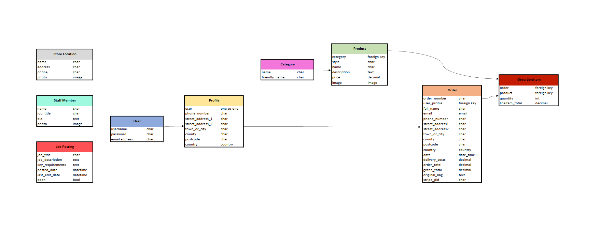

# <div align="center">**Luxe Avenue**</div>

## **Project Overview**

Luxe Avenue is a fictitious multi-brand full stack ecommerce store built using Django, Python, Javascript, HTML, CSS and Bootstrap 4. This web application is a full business to consumer (B2C) online retailer selling luxury goods. The website is deployed to Heroku, uses Amazon S3 for cloud storage and Stripe for payments.  No real orders can be processed for delivery as this project is for educational purposes only.

 The site provides users with different functionalities that ease the process of purchasing a product. Users of the site can browse all products, filter products with a variety of categories and also search for specific products by keyword search. From the list of products, users can select them to display each product in detail, giving them the option to add the product to their shopping bag or return to the product list page to browse other products. Authenticated users can also checkout securely inputting their personal and payment details to purchase a product and also store these details on their profile for easier future purchases. On the other hand, the site provides the store owner with functionalities such as product management (add, edit & delete products) without accessing the admin interface.

 This website application includes CRUD functionality, user authentication (using Django's allauth library), email validation and database interaction.

 # **Table of Contents**

[UX](#ux)

   1. [Strategy](#strategy)
   * [Project Goals](#project-goals)
   * [User Stories](#user-stories)
   2. [Scope](#scope)
   * [Features](#features)
   * [Future Features](#future-features)
   3. [Structure](#structure)
   * [Code Structure](#code-structure)
   * [Database Models](#database-models)
   4. [Skeleton](#skeleton)
   * [Wireframes](#wireframes)
   * [Home Page(Desktop)](https://github.com/)
   5. [Surface](#surface)
   * [Colour Scheme](#colour-scheme)
   * [Typography](#typography)
   * [Media](#media)

   [Web Marketing](#web-marketing)

   [Technologies Used](#technologies-used)

## **UX**

## 1. Strategy

### **Project Goals**

- To provide a B2C ecommerce site selling luxury goods to customers.
- To provide users with different functionalities such as user authentication, product purchase, profile, sign-up for newsletter, store locator.
- To provide the store owner the ability to manage the site to update products and information.<br><br>

### **User Stories**

***Epic 1: Basic Setup of Shop and Products***

| ID | User Story                                                                                          |
|----|-----------------------------------------------------------------------------------------------------|
| 1  | As a **developer** I can set up the project so that it is ready for implementing core features      |
| 2  | As a **developer** I can create a base HTML template page so that all pages can use the same format |
| 3  | As a **developer** I can setup the project basic apps so that the products can be displayed         |

***Epic 2: Admin/Shop Owner***
| ID  | User Story                                                                                                                                                                 |   |
|-----|----------------------------------------------------------------------------------------------------------------------------------------------------------------------------|---|
| 4   | As a **shop owner** I can log in so that I have full access to the store administration page                                                                              |   |
| 5   | As a **shop owner** I can add products to the shop so that there is a good variety of products available                                                                  |   |
| 6   | As a **shop owner** I can edit/delete a category so that the website is up to date at all times                                                                           |   |
| 7   | As a **shop owner** I can edit/update product information so that the product description and price is up to date                                                         |   |
| 8   | As a **shop owner** I can delete products so that I can remove products that are no longer available                                                                      |   |
| 9   | As a **shop owner** I can add a new category to the shop so that there is a better selection of products available                                                        |   |
| 10  | As a **shop owner** I can send a newsletter to registered shoppers via email so that they are kept up to date about promotions, special offers and new products available |   |
| 11  | As a **shop owner** I can unsubscribe those shoppers who request to unsubscribe from the newsletter so that they don't continue to receive the newsletter                  |   |
| 12  | As a **shop owner** I can add a store finder so that customers can see a list of the shops branches and locate one nearest to them                                        |   |
| 13  | As a **shop owner** I can display the privacy policy page on the site so that I can maintain privacy compliance and build user trust                                      |   |
| 14  | As a **shop owner** I can create a sitemap xml and a robots.txt file so that search engines can find and index the new or updated website faster                          |   |

***Epic 3: Viewing and Navigation***
| ID | User Story                                                                                                                       |
|----|----------------------------------------------------------------------------------------------------------------------------------|
| 15 | As a **customer** I can browse the website and easily  navigate throughout the site so that I can view the contents              |
| 16 | As a **customer** I can view a list of products so that I can select some to purchase                                            |
| 17 | As a **customer** I can view individual product details so that I can see the product price description and image                |
| 18 | As a **customer** I can search for products by category or using the search bar so that I can easily find what I am looking for  |
| 19 | As a **customer** I can easily view the total of my purchases so that I can keep track of my spending                            |
| 20 | As a **customer** I can add multiple items to my shopping bag so that I can buy multiple items in the same transaction           |
| 21 | As a **customer** I can make purchases as a guest so that I can place my order quickly without having to register for an account |
| 22 | As a **customer** I can subscribe to the shops newsletter so that I can find out about new products and promotions               |
| 23 | As a **customer** I can unsubscribe from the shops newsletter so that I don't have to receive newsletters anymore                 |
| 24 | As a **customer** I can see a list of store branches so that I can find the closest one to me                                    |                                                        |

***Epic 4: Registration and Accounts***
| ID | User Story                                                                                                                                                         |                                                    |
|----|--------------------------------------------------------------------------------------------------------------------------------------------------------------------|----------------------------------------------------|
| 25 | As a **customer** I can choose to register for an account so that I can use features for logged in users                                                           |                                                    |
| 26 | As a **registered customer** I can easily log in to and out of my account so that I can access my account information                                              |                                                    |
| 27 | As a **registered customer** I can easily reset my password if I forget it so that I can regain access to my account                                               |                                                    |
| 28 | As a **registered customer** I can receive an email confirmation after registering for an account so that I can verify that my account registration was successful |                                                    |
| 29 | As a **registered customer** I can easily register for an account so that I can view my profile                                                                    |                                                    |
| 30 | As a **registered customer** I can have a personalized profile so that I can see my order history,  order confirmation and save my payment information |
| 31 | As a **customer** I can connect to the shops social media sites so that I can keep up to date with their products, promotions and offers                              |

***Epic 5: Searching and Filtering***
| ID | User Story                                                                                                                                                       |
|----|------------------------------------------------------------------------------------------------------------------------------------------------------------------|
| 32 | As a **customer** I can filter a specific category of products so that I can sort the products in that category by name                                          |
| 33 | As a **customer** I can sort the list of available products so that I can view products by best priced,name and category alphabetically ascending and descending |
| 34 | As a **customer** I can search for a product by name so that I can find the particular product I would like to buy                                               |

***Epic 6: Purchasing and Payment***

| ID | User Story                                                                                                                                        |
|----|---------------------------------------------------------------------------------------------------------------------------------------------------|
| 35 | As a **customer** I can add more products of the same kind to my shopping bag so that I can purchase the correct quantity of the item that I need |
| 36 | As a **customer** I can remove items from my shopping bag so that I am not purchasing what I dont need                                            |
| 37 | As a **customer** I can see items in my shopping bag so that I can keep track on what I am spending                                               |
| 38 | As a **customer** I can enter my personal information and credit/debit card details so that I can complete  the purchasing process                |
| 39 | As a **customer** I can view an order confirmation of my purchases so that I have a record of what I bought                                       |

***Epic 7: Digital Marketing***
| ID | User Story                                                                                              |
|----|---------------------------------------------------------------------------------------------------------|
| 40 | As a **shop owner** I can create a facebook business page so that I can increase traffic to my website |<br><br>

## 2. Scope

### **Features**

#### ***Navigation Bar***
The main navigation bar appears on every page of the website so customers can easily navigate throughout the site. It is located at the top of the webpage and has different functionalities. It has links for all products, products new in, jewellery, bags, accessories, fragrance and special offers. Most of these links has dropdown links for different products and offers. The new in and fragrance links just redirect the customer to those pages.  

The shop name is on the left and when clicked on any page returns the customer to the main page. The search bar is in the middle and to the right the user account dropdown menu and the shopping bag icon. When a registered customer is logged in their profile link appears in the dropdown menu and a logout link. When the shop owner/admin is logged in the product management link is visible.

Below the product search bar, there are individual navigation links that allow the user to browse through the products via different filters. On smaller viewports, a hamburger menu is present to keep the look of the navbar refined and clean.

#### ***Banner***

The banner area is being used to flag the free delivery threshold.

#### ***Footer***

The footer appears on every page of the site and displays links social links, privacy policy and a newsletter signup form.

#### ***Home Page***

The home page features a hero image with a transbox and a message to the customer inviting them to "Step Into Spring" and a "Shop the latest" button to encourage them to explore the products available in the shop.

#### ***Products List Page***

The products list page shows all the stock the shop has available for sale. Each product displays an image of the product, the name, price and category tag of the product. Each product can be clicked on to view the product in detail on another page. Products can also be filtered via different categories; by price high to low or vice versa, by name and category alphabetically in ascending or descending order.

#### ***Product Detail Page***

The product detail page displays all the information about the selected product including the name of the product, the price, category and product description. If the customer decides to purchase the item they can add it to their shopping bag and also select the quantity of the item they wish to purchase to their shopping bag for checkout. A success message is displayed on the screen when products are added.

#### ***Shopping Bag Page***

Once the customer is happy with their selection, they can advance to the shopping bag page to confirm the items selected, quantity and prices. Customers can also add or remove items from their shopping bag whilst on this page to update the quantity before checkout.

#### ***Checkout Page***

When the customer is ready to proceed to the checkout page after selecting their choice of products, they are required to fill out a form detailing their personal information: name, email address, phone number, street address, town/city, county, postal code and country. They are also required to fill out payment information which is powered by Stripe: credit card number. expiry date and CVC. As Stripe is not fully activated in this project, only test payment details can be used to process payments. Customers also have the option to save their personal information to their profile so future checkouts are easier instead of having to fill out the form each time they place an order. The order summary is displayed next to the order form so that it is clear to the customer the selection of products they are ordering. If the checkout was successful the customer is taken to the order confirmation page.

#### ***Order Confirmation Page***

The order confirmation page displays the customer's order number, order details, delivery details and billing information. A success message appears informing the customer that their order has been processed, confirmation of their order number and telling them that an order confirmation email will be sent to them. At the bottom of this page there is a button inviting the customer to browse special offers to encourage them not to leave the site immediately.

#### ***Customer Profile Page***

Registered customers can view their profile page which lists their saved personal information which can be used for future purchases and also a history of the orders they have placed with their respective order numbers. The customer can click on the order numbers to view the order details.

#### ***Product Management Page***

The shop owner can perform the full CRUD (create, read, update and delete) product management operations directly on the front end, when they are logged in.  When the Product Management link is clicked this takes the shop owner to the product management page where they can easily add a new product to the store.

To edit a product, the shop owner only needs to go to the product detail page where underneath the product image is the edit product button. Clicking this button will open the product management page - edit product where the form fields are already pre-populated with the available data about the product. A toast also shows an alert that the product is being edited.

To delete a product, next to the edit a product button is the Delete Product button that when clicked opens a modal to confirm the intent of deleting a product to avoid the unintended deletion of data. 

### **Future Features**

- A brands category displayed under the All Products dropdown menu on the navigation bar to display the brands available in the shop.
- A Brand Management link on the My Account dropdown menu so the shop owner can add a new brand or update an existing one at the front end. This link would redirect the shop owner to the brand management page where they can easily add a new brand.
- Add filter by brand name.
- A contact form accessed from a link in the navigation bar, so customers can fill out the form and submit it if they have a query.
- A digital gift card product.<br><br>

## 3. Structure

### **Code Structure**

Code is built using applications in Django.  The applications used are listed below:

#### ***Apps***

- bag - functionality for managing the shopping bag.
- products - functionality for managing the products available for customers to purchase in the ecommerce shop.
- profiles - functionality for managing user profiles.
- checkout - functionality for managing the e-commerce transactions for the site with real-life email confirmations.
-  home - functionality for managing the home page as well as separate job postings and about us pages.<br><br>

### **Database Models**

As this project utilises Django which is a Model, View & Template framework, a connection to database table models is required. An entity relationship diagram was created to visually map out the structure of the databases and models. The ERD was created on an excel spreadsheet.

#### ***ERD Diagram***

<br><br>

## 4. Skeleton

### **Wireframes**

Low fidelity wireframes were designed using Powerpoint. Minor changes were applied since drafting the wireframes in the beginning of the project e.g. a bag app was created instead of a basket app as a shopping bag was more suitable for the ecommerce site design. The general layout and structure of the main content for each page of the website on desktop and mobile are captured in the wireframes which can be viewed below. 

#### ***Desktop***

1. [Home Page](./readme-docs/wireframes/desktop/home-page.png)
2. [Products List Page](./readme-docs/wireframes/desktop/products-list.png)
3. [Product Detail Page](./readme-docs/wireframes/desktop/product-detail.png)
4. [Add to Bag Page](./readme-docs/wireframes/desktop/add-to-bag.png)
5. [Shopping Bag Page](./readme-docs/wireframes/desktop/shopping-bag.png)
6. [Payment Page](./readme-docs/wireframes/desktop/payment-page.png)
7. [Sign Up Page](./readme-docs/wireframes/desktop/register.png)
8. [Sign In Page](./readme-docs/wireframes/desktop/sign-in-page.png)
9. [Sign Out Page](./readme-docs/wireframes/desktop/sign-out-page.png)
10. [Reset Password Page](./readme-docs/wireframes/desktop/reset-password.png)
11. [Profile Page](./readme-docs/wireframes/desktop/profile-page.png)
12. [Product Management Page](./readme-docs/wireframes/desktop/product-management.png)
- [Home Page(Desktop)](https://github.com/)

#### ***Mobile***

13. [Home Page](./readme-docs/wireframes/mobile/home-page.png)
14. [Products List Page](./readme-docs/wireframes/mobile/products-list.png)
15. [Product Detail Page](./readme-docs/wireframes/mobile/product-detail.png)
16. [Add to Bag Page](./readme-docs/wireframes/mobile/add-to-bag.png)
17. [Shopping Bag Page](./readme-docs/wireframes/mobile/shopping-bag.png)
18. [Payment Page](./readme-docs/wireframes/mobile/payment-page.png)
19. [Sign Up Page](./readme-docs/wireframes/mobile/register.png)
20. [Sign In Page](./readme-docs/wireframes/mobile/sign-in-page.png)
21. [Sign Out Page](./readme-docs/wireframes/mobile/sign-out-page.png)
22. [Reset Password Page](./readme-docs/wireframes/mobile/reset-password.png)
23. [Profile Page](./readme-docs/wireframes/mobile/profile-page.png)
24. [Product Management Page](./readme-docs/wireframes/mobile/product-management.png)<br><br>

## 5. Surface

### **Colour Scheme**

The colour scheme was inspired by the hero image on the home page. The palette below was taken from Coolers.

<br><br>

### **Typography**

The font used is DM Serif Display. This font was chosen because the style suits the design of the website. It has a classic look and it is clear and easy to read.

<br><br>

### **Media**

All images were taken from:

* [Kaggle](https://www.kaggle.com/)
* [Pixabay](https://www.pixabay.com/)
* [Freepik](https://www.freepik.com/)<br><br>

## Search Engine Optimisation

 A set of keywords for search engines were used for helping potential users find the webpage. The aim is to select keywords with relatively high volume of searches and low competition in search results. Keywords were implemented in images alt text and meta tags in base.html.

A sitemap.xml and robots.txt file have been created to help aid search engines locate the site.<br><br>

## Web Marketing

For the purposes of digital marketing, a requirement of the ecommerce project was to create a facebook page to promote the business. Facebook is a key marketing strategy for the success of an ecommerce business. See Facebook page screenshot below:

<br><br>

## Technologies Used

### ***Languages*** 

- **HTML5**
- **CSS3**
- **Javascript**
- **Python**<br><br>

### ***Hosting***

- **Heroku** - used to deploy the project
- **Gunicorn** - a pure-Python HTTP server for WSGI applications
- **ElephantSQL** - used as the database for the project during development
- **AWS** - S3 bucket storage for storing static files and media files<br><br>

### ***Frameworks, Libraries and Tools*** 

- **Github:**  Version control - stores the repository of the project, git issues were used for User Stories,
  git project was used for kanban board milestones
- **Gitpod:**  IDE workspace to write code and push to github
- **Bootstrap4:** was imported for responsiveness and styling of the site
- **Django:** was the web framework used to build the project
- **Django AllAuth:** to enable users to create accounts and log in. Allauth is a third-party Django application.
- **Crispy Forms:** used to give forms improved styling
- **Stripe:** was used to process payments
- **Font Awesome:** for the icons used for the project
- **Google Fonts:** for selecting the font used for the project
- **Coolers:** for generating a colour palette for website colour scheme
- **RandomKeygen:** was used to generate secret key
- **Convertio:** used to convert images from png to webp format
- **Table-magic** used to build tables in markdown
- **Facebook:** used to create the Luxe Avenue facebook page
- **Mailchimp:** was used to implement email newsletter sign up form
- **Am I Responsive:** to check for responsiveness and to create images of the website on different screen sizes<br><br>

## Testing

The W3C Markup Validator, W3C CSS Validator Services, JS Hint and PEP8 were used to validate the code to ensure there were no syntax errors in the project.

### **HTML**
All HTML pages were checked using [W3CMarkupValidationService](http://)
- No errors were found.

### **CSS**
The CSS file was checked using [W3CCSSValidationService](http://)
- No errors were found.

### **Python**
The following python files were checked using [pep8CI](https://pep8ci.herokuapp.com/). No errors found apart from some lines too long in settings.py, env.py and **???????** files.:<br>
- admin.py<br>
- apps.py<br>
- asgi.py<br>
- env.py<br>
- forms.py<br>
- models.py<br>
- settings.py<br>
- tests.py<br>
- urls.py<br>
- views.py<br>
- wsgi.py<br>

### **Javascript**
The Javascript file was checked using [JSHint]()
- No errors were found.<br><br>

## **Code Formatting**
HTML formatted using [HTML Formatter](https://webformatter.com)<br><br>


ou can safely delete this README.md file, or change it for your own project. Please do read it at least once, though! It contains some important information about Gitpod and the extensions we use. Some of this information has been updated since the video content was created. The last update to this file was: **September 1, 2021**

## Gitpod Reminders

To run a frontend (HTML, CSS, Javascript only) application in Gitpod, in the terminal, type:

`python3 -m http.server`

A blue button should appear to click: _Make Public_,

Another blue button should appear to click: _Open Browser_.

To run a backend Python file, type `python3 app.py`, if your Python file is named `app.py` of course.

A blue button should appear to click: _Make Public_,

Another blue button should appear to click: _Open Browser_.

In Gitpod you have superuser security privileges by default. Therefore you do not need to use the `sudo` (superuser do) command in the bash terminal in any of the lessons.

To log into the Heroku toolbelt CLI:

1. Log in to your Heroku account and go to *Account Settings* in the menu under your avatar.
2. Scroll down to the *API Key* and click *Reveal*
3. Copy the key
4. In Gitpod, from the terminal, run `heroku_config`
5. Paste in your API key when asked

You can now use the `heroku` CLI program - try running `heroku apps` to confirm it works. This API key is unique and private to you so do not share it. If you accidentally make it public then you can create a new one with _Regenerate API Key_.

------

## Release History

We continually tweak and adjust this template to help give you the best experience. Here is the version history:

**September 1 2021:** Remove `PGHOSTADDR` environment variable.

**July 19 2021:** Remove `font_fix` script now that the terminal font issue is fixed.

**July 2 2021:** Remove extensions that are not available in Open VSX.

**June 30 2021:** Combined the P4 and P5 templates into one file, added the uptime script. See the FAQ at the end of this file.

**June 10 2021:** Added: `font_fix` script and alias to fix the Terminal font issue

**May 10 2021:** Added `heroku_config` script to allow Heroku API key to be stored as an environment variable.

**April 7 2021:** Upgraded the template for VS Code instead of Theia.

**October 21 2020:** Versions of the HTMLHint, Prettier, Bootstrap4 CDN and Auto Close extensions updated. The Python extension needs to stay the same version for now.

**October 08 2020:** Additional large Gitpod files (`core.mongo*` and `core.python*`) are now hidden in the Explorer, and have been added to the `.gitignore` by default.

**September 22 2020:** Gitpod occasionally creates large `core.Microsoft` files. These are now hidden in the Explorer. A `.gitignore` file has been created to make sure these files will not be committed, along with other common files.

**April 16 2020:** The template now automatically installs MySQL instead of relying on the Gitpod MySQL image. The message about a Python linter not being installed has been dealt with, and the set-up files are now hidden in the Gitpod file explorer.

**April 13 2020:** Added the _Prettier_ code beautifier extension instead of the code formatter built-in to Gitpod.

**February 2020:** The initialisation files now _do not_ auto-delete. They will remain in your project. You can safely ignore them. They just make sure that your workspace is configured correctly each time you open it. It will also prevent the Gitpod configuration popup from appearing.

**December 2019:** Added Eventyret's Bootstrap 4 extension. Type `!bscdn` in a HTML file to add the Bootstrap boilerplate. Check out the <a href="https://github.com/Eventyret/vscode-bcdn" target="_blank">README.md file at the official repo</a> for more options.

------

## FAQ about the uptime script

**Why have you added this script?**

It will help us to calculate how many running workspaces there are at any one time, which greatly helps us with cost and capacity planning. It will help us decide on the future direction of our cloud-based IDE strategy.

**How will this affect me?**

For everyday usage of Gitpod, it doesn’t have any effect at all. The script only captures the following data:

- An ID that is randomly generated each time the workspace is started.
- The current date and time
- The workspace status of “started” or “running”, which is sent every 5 minutes.

It is not possible for us or anyone else to trace the random ID back to an individual, and no personal data is being captured. It will not slow down the workspace or affect your work.

**So….?**

We want to tell you this so that we are being completely transparent about the data we collect and what we do with it.

**Can I opt out?**

Yes, you can. Since no personally identifiable information is being captured, we'd appreciate it if you let the script run; however if you are unhappy with the idea, simply run the following commands from the terminal window after creating the workspace, and this will remove the uptime script:

```
pkill uptime.sh
rm .vscode/uptime.sh
```

**Anything more?**

Yes! We'd strongly encourage you to look at the source code of the `uptime.sh` file so that you know what it's doing. As future software developers, it will be great practice to see how these shell scripts work.

---

Happy coding!
